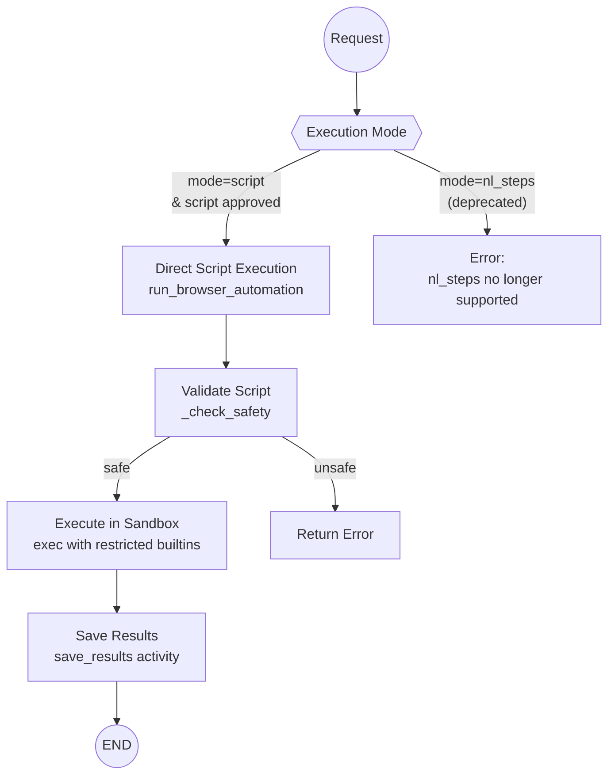

# Test Execution Flow

## Pipeline

1. **Schedule Trigger**: Temporal Schedule detects due cron → triggers `TestExecutionWorkflow`
2. **Job Creation**: Creates TestRun record with status='pending'
3. **Prepare Test**: `prepare_test` activity loads test definition and steps from DB
4. **Script Execution**: `run_browser_automation` activity executes approved Playwright script
5. **Result Saving**: `save_results` activity persists:
   - Summary to `test_runs` table
   - Individual step results to `test_cases` table
6. **Dashboard Update**: Frontend polls app endpoint → `sync_run_result()` reads job store

## Test Runner Agent (DeepAgents)



## Key Modules

| Module | Purpose |
|--------|---------|
| `agents/test_composer/agent.py` | DeepAgent singleton (plan gen + script gen) |
| `agents/test_composer/planner_agent.py` | Test plan generation and refinement via LLM |
| `agents/test_composer/script_generator.py` | Playwright script generation via LLM |
| `agents/test_composer/script_executor.py` | Sandboxed script execution |
| `agents/test_composer/page_fetcher.py` | DOM extraction for LLM context |
| `agents/test_composer/test_tools.py` | Agent tools (save plan, get results, validate script) |
| `temporal/activities/test_activities.py` | Temporal activities (prepare, execute, save, fail) |
| `services/execution_service.py` | Test run creation and result persistence |

## Script Lifecycle

```
none → generating → draft → validated → approved
                  ↘ failed                ↗
         (validation failed)     (user approves)
```

## Test Execution Verification

1. Check test_runs table for summary records
2. Check test_cases table for step-by-step results
3. Verify status transitions: pending → running → passed/failed
4. Confirm timestamps and durations are saved correctly
