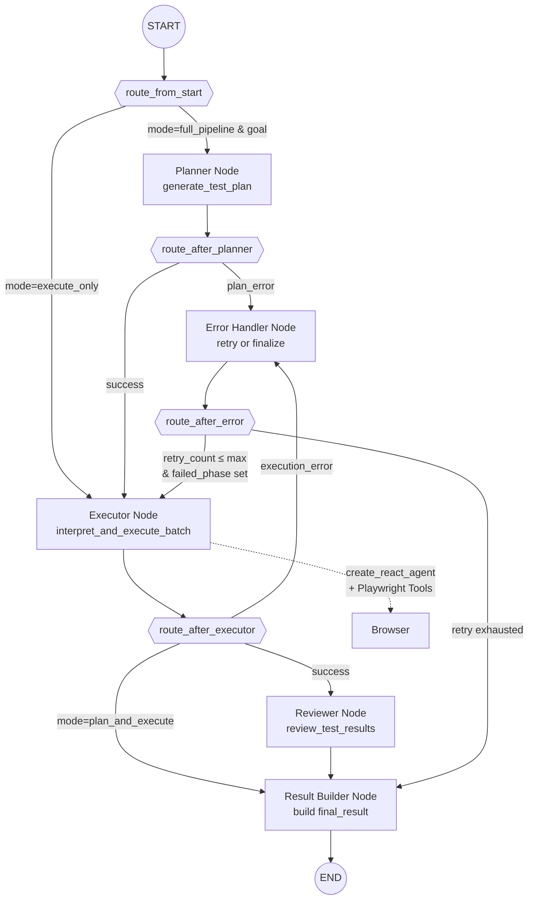

# Test Execution Flow

## Pipeline

1. **Schedule Trigger**: Temporal Schedule detects due cron → triggers `ScheduleExecutionWorkflow`
2. **Job Creation**: Creates TestRun record with status='pending'
3. **Test Execution**: Workflow calls execution with test_definition_id
4. **LangGraph Pipeline**: `supervisor_graph.py` routes to planner/executor/reviewer nodes
5. **Browser Automation**: `executor_agent.py` uses `create_react_agent` with Playwright tools
6. **Result Saving**: `ExecutionService.save_test_results()` saves:
   - Summary to `test_runs` table
   - Individual step results to `test_cases` table
7. **Dashboard Update**: Frontend queries PostgreSQL for latest results

## LangGraph Supervisor Graph

## Test Execution Verification

1. Check test_runs table for summary records
2. Check test_cases table for step-by-step results
3. Verify status transitions: pending → running → passed/failed
4. Confirm timestamps and durations are saved correctly
