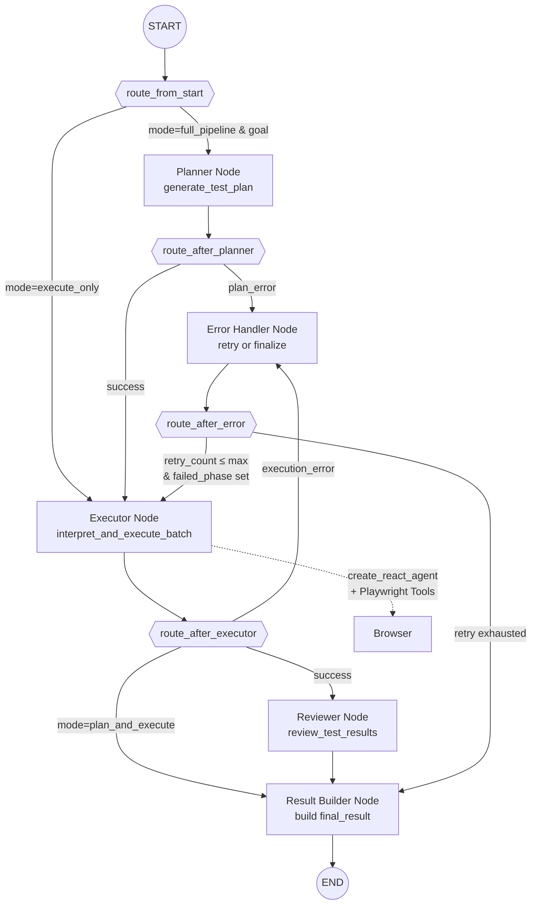

# CLAUDE.md

This file provides guidance to Claude Code (claude.ai/code) when working with code in this repository.

## Project Overview

AI-powered E2E testing framework using GLM LLM + LangGraph + Playwright for browser automation.

The system executes natural language test definitions using AI to perform browser automation through Playwright tools.

## Architecture

### Microservices Architecture (unified backend)
```
Frontend (React/Vite :5173) → Nginx (:8080) → Unified Backend (FastAPI :8001, host :8011)
                                                    ↓
                              PostgreSQL (:5432) ← Celery Worker + Beat ← Redis
```

**Test Execution Pipeline (LangGraph Supervisor Graph):**



**LLM Integration:**
- All AI features use GLM via OpenAI-compatible API (`ChatOpenAI` from `langchain_openai`)
- Config: `LLM_API_KEY`, `LLM_BASE_URL`, `LLM_MODEL` env vars
- Factory: `app/core/agent_config.py` → `get_llm()`

**Service Interactions:**
- **Unified Backend** (`service/backend/`): test definitions, schedules, jobs, analytics, sessions
- **Celery Workers** execute tests via LangGraph + Playwright; load test data from PostgreSQL (not HTTP self-calls)
- **Job metadata** stored in Redis (`app/core/job_store.py`) for status polling across API restarts
- Frontend uses hash-based routing: `#dashboard`, `#studio`, `#schedules`
- Use `docker compose` (not `docker-compose`) from `service/`

## Development Commands

### Microservices Development
```bash
cd service
docker compose up -d          # Start all services with hot-reload
docker compose ps             # Check service status
docker compose logs -f [service]  # View logs
docker compose restart [service]  # Restart specific service
```

**Hot-reload is enabled for:**
- `backend/app:/app/app` (API and Celery worker)
- `frontend/src:/app/frontend` (Vite dev server)

Changes to these directories are automatically reflected without rebuilding.

### Database Operations
```bash
# Connect to PostgreSQL
docker exec -it cc-test-postgres psql -U cc_test_user -d cc_test_db

# Check specific table
docker exec cc-test-postgres psql -U cc_test_user -d cc_test_db -c "\d test_runs"
docker exec cc-test-postgres psql -U cc_test_user -d cc_test_db -c "SELECT COUNT(*) FROM test_cases"

# Backup
docker exec cc-test-postgres pg_dump -U cc_test_user cc_test_db > backup.sql
```

## Database Schema Relationships

**Core Tables:**
- `test_definitions`: Test case definitions (the "what")
- `test_steps`: Sequential steps for each test definition
- `test_runs`: Execution instances with status and timestamps
- `test_cases`: Individual test step results (linked to test_runs)
- `schedules`: Cron-based test scheduling configurations

**Important Relationships:**
- `test_runs.test_definition_id` → `test_definitions.id`
- `test_cases.run_id` → `test_runs.id` (execution details)
- `test_cases.test_definition_id` → `test_definitions.id`
- `schedules.test_definition_id` → `test_definitions.id` (single test)
- `schedules.test_suite_id` → `test_suites.id` (multiple tests)

**Critical Field Distinction:**
- `test_runs.total_tests`: Number of test steps in this run (cumulative)
- `test_runs.total_duration_ms`: Execution duration in milliseconds
- `test_cases.duration`: Individual step duration in milliseconds
- Use `test_definitions` count for "test case总数" not `test_runs.total_tests`

## Frontend Development

**⚠️ IMPORTANT: Always consult DESIGN.md before writing UI code**

This project uses an IBM Carbon-inspired design system. Before creating or modifying any UI components:

1. **Read DESIGN.md** - Complete design system specifications
2. **Follow the design tokens** - Use `--cds-*` naming convention for CSS variables
3. **Apply Carbon principles** - 0px border-radius, flat design, IBM Plex Sans typography
4. **Use the color palette** - IBM Blue 60 (#0f62fe) as the sole accent color

**Design System Highlights:**
- **Border-radius**: 0px on buttons, inputs, cards (24px only for tags/labels)
- **Colors**: Monochromatic grays + IBM Blue 60 (#0f62fe)
- **Typography**: IBM Plex Sans (weight 300/400/600 - NO weight 700)
- **Spacing**: 8px base unit, 16px component padding, 48px button height
- **Depth**: Background-color layering, not shadows (flat design)
- **Inputs**: Bottom-border only, #f4f4f4 background

**Routing:** Hash-based (`#dashboard`, `#studio`, `#schedules`)

**API Calls:** Via Nginx on port 8080 (or Vite dev with same-origin `/api/v1`)
- Unified API: `http://localhost:8080/api/v1/` (or `http://localhost:8011/api/v1/` direct to backend)
- Analytics: `http://localhost:8080/api/v1/analytics/`

**Frontend Structure:**
- `pages/`: Page-level components (DashboardPage, StudioPage, SchedulesPage)
- `components/`: Reusable UI components
- `services/`: API service layer
- `hooks/`: Custom React hooks
- `contexts/`: React context providers
- `App.jsx`: Main routing and layout component

**State Management:**
- Direct state updates for simple cases
- `refreshKey` pattern to trigger list refreshes after CRUD operations
- Context providers for shared state (auth, notifications)

**When modifying UI:**
- Always check DESIGN.md first for the correct patterns
- Prefer creating new components following the design system over patching old ones
- Test responsive behavior at 320px, 672px, 1056px, and 1312px breakpoints

## Internationalization (i18n)

**Current Status:** English only

**Required Languages:**
- English (en) - Current default
- Chinese (zh) - Primary secondary language

**Implementation Requirements:**

1. **Frontend i18n:**
   - Use `react-i18next` or similar i18n library
   - Create translation files in `frontend/src/locales/` directory
   - Structure: `locales/en.json`, `locales/zh.json`
   - Language switcher component in the navigation bar
   - Persist language preference in localStorage

2. **Backend i18n:**
   - Error messages and API responses should support multiple languages
   - Use `Accept-Language` header to determine user's language preference
   - Translation files for backend messages in `backend/app/locales/`

3. **Translation Coverage:**
   - All UI text (buttons, labels, headings, messages)
   - Error messages and validation text
   - Status badges and tooltips
   - Date/time formatting (locale-specific)
   - Number formatting (locale-specific)

4. **Best Practices:**
   - Never hardcode user-facing text in components
   - Use translation keys consistently
   - Keep translations in sync across languages
   - Test with both languages during development

## Backend Development

**Unified Backend (FastAPI):**
- `app/api/`: REST endpoints (organized by domain)
- `app/services/`: Business logic (execution, schedules, sessions)
- `app/tasks/`: Celery tasks (test_execution, schedule_sync)
- `app/models/`: SQLAlchemy ORM models
- `app/agents/`: LangGraph agent pipeline (supervisor_graph, executor_agent, nodes)
- `app/agent_tools/`: Playwright tools for browser automation
- `app/core/`: Configuration and security (agent_config, job_store, security)
- `app/schemas/`: Pydantic schemas for request/response validation
- `app/middleware/`: Custom middleware (auth, CORS)

**Critical Service Methods:**
- `ExecutionService.save_test_results()`: Saves both test_runs summary AND test_cases details
- `ScheduleManager.parse_cron_expression()`: Validates cron expressions

## Test Execution Flow

1. **Schedule Trigger:** Celery Beat detects due schedule → calls `schedule_sync.execute_scheduled_tests()`
2. **Job Creation:** Creates TestRun record with status='pending'
3. **Test Execution:** Worker calls `test_execution.execute_test()` with test_definition_id
4. **LangGraph Pipeline:** `supervisor_graph.py` routes to planner/executor/reviewer nodes
5. **Browser Automation:** `executor_agent.py` uses `create_react_agent` with Playwright tools
6. **Result Saving:** `ExecutionService.save_test_results()` saves:
   - Summary to `test_runs` table
   - Individual step results to `test_cases` table
7. **Dashboard Update:** Frontend queries PostgreSQL for latest results

**Key Timing Fields:**
- All timestamps in PostgreSQL are naive datetime (no timezone)
- Use `datetime.utcnow()` for consistency, not `datetime.now(timezone.utc)`
- JavaScript timestamps are milliseconds, PostgreSQL timestamps are seconds

## Common Issues and Solutions

**Issue:** Scheduled tests not executing
- **Solution:** Check Celery Beat logs, verify schedule is_active=true, ensure cron expression is valid

**Issue:** Test results not showing in dashboard
- **Solution:** Verify `test_cases` records are created (check `run_id` foreign key), ensure JOIN includes test_definitions table

**Issue:** Hot-reload not working
- **Solution:** Volume mounts are in docker-compose.yml, changes should auto-apply. If not, restart the specific service.

**Issue:** "测试用例总数" mismatch (72 vs 4)
- **Solution:** Use `COUNT(*) FROM test_definitions` for test count, not `SUM(total_tests) FROM test_runs`

**Issue:** Invalid Date in frontend
- **Solution:** Database timestamps are milliseconds, use `new Date(parseInt(timestamp))` in JavaScript

**Issue:** Schedule executing infinitely
- **Solution:** Check `next_run_time` is properly updated after execution, verify `is_active` status

## Configuration Files

**Microservices:** `service/.env` (PostgreSQL, Redis, LLM API keys)

**Environment Variables:**
- `LLM_API_KEY`: Required for GLM LLM access
- `LLM_BASE_URL`: LLM API endpoint (default: `https://open.bigmodel.cn/api/paas/v4`)
- `LLM_MODEL`: Model name (default: `glm-4-plus`)
- `POSTGRES_PASSWORD`: Database credentials
- `SECRET_KEY`: JWT signing key

## Testing Strategy

**Unit Tests:** Co-located with source files
**Integration Tests:** `tests/`

**Test Execution Verification:**
1. Check test_runs table for summary records
2. Check test_cases table for step-by-step results
3. Verify status transitions: pending → running → passed/failed
4. Confirm timestamps and durations are saved correctly

## Performance Considerations

**Dashboard Queries:**
- Use `created_at` for filtering (always populated), not `start_time` (often NULL)
- Index on `test_runs.created_at` for time-based queries
- Join with test_definitions to get test names (add test_definition_id to queries)

**Celery Workers:**
- Default concurrency: 2 workers
- Scale with: `docker compose up -d --scale celery-worker=4`
- Task routing: test_execution tasks go to workers, schedule_sync to beat

## API Port Mappings

- **8080:** Nginx reverse proxy (routes to backend services)
- **8011:** Unified Backend (FastAPI)
- **5173:** Vite dev server (for React frontend hot-reload)
- **5433:** PostgreSQL (external access)
- **6380:** Redis (external access)
