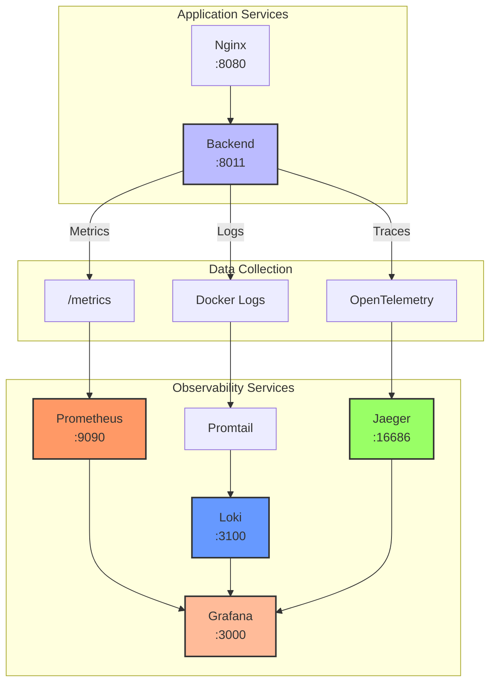

# Observability Stack - Docker Compose

This directory contains the Docker Compose configuration for deploying the observability stack (Prometheus, Loki, Promtail, Jaeger, Grafana) without requiring Kubernetes.

## Architecture



## Quick Start

```bash
cd infrastructure/observability
./start-observability.sh
```

Or manually:

```bash
cd service
docker compose -f docker-compose.yml -f ../infrastructure/observability/docker-compose.observability.yml up -d
```

## What's Included

- **Prometheus** (port 9090): Metrics collection and storage
  - Scrapes metrics from backend `/metrics` endpoint every 15s
  - Stores time-series data with 15-day retention
  
- **Loki** (port 3100): Log aggregation
  - Indexes logs by labels (container_name, level, method, status_code)
  - Stores logs with efficient compression
  
- **Promtail**: Log collection agent
  - Reads Docker container logs from `/var/lib/docker/containers`
  - Parses JSON logs and extracts labels
  - Sends logs to Loki
  
- **Jaeger** (port 16686): Distributed tracing
  - Receives OpenTelemetry traces from backend
  - Stores traces in memory (development-friendly)
  - Provides UI for trace visualization
  
- **Grafana** (port 3000): Visualization dashboards
  - Pre-configured datasources for Prometheus, Loki, Jaeger
  - 3 pre-built dashboards for monitoring
  - Auto-provisioned on startup

## Directory Structure

```
observability/
├── prometheus/
│   └── prometheus.yml          # Prometheus scrape configuration
├── loki/
│   └── loki-config.yml          # Loki log storage configuration
├── promtail/
│   └── promtail-config.yml      # Promtail log collection configuration
├── grafana/
│   ├── provisioning/
│   │   ├── datasources/
│   │   │   └── datasources.yml  # Grafana datasource provisioning
│   │   └── dashboards/
│   │       └── dashboards.yml   # Grafana dashboard provider config
│   └── dashboards/
│       ├── overview-dashboard.json
│       ├── api-performance-dashboard.json
│       └── database-metrics-dashboard.json
└── README.md                     # This file
```

## Features

### Prometheus Metrics

Backend exposes Prometheus-compatible metrics at `/metrics`:

**Available Metrics:**
- `http_requests_total{method, endpoint, status}`: Counter for HTTP requests
- `http_request_duration_seconds_bucket{le, method, endpoint}`: Histogram for request latency
- `active_connections`: Gauge for active database connections

**Example Queries:**
```promql
# Request rate by method
rate(http_requests_total[5m])

# P95 latency
histogram_quantile(0.95, rate(http_request_duration_seconds_bucket[5m])) * 1000

# Error rate
rate(http_requests_total{status_code!~"2.."}[5m])
```

### Structured Logging

Logs are JSON-formatted with correlation IDs:

```json
{
  "level": "info",
  "message": "Request completed",
  "correlation_id": "abc123",
  "method": "GET",
  "path": "/api/v1/schedules/",
  "status_code": 200,
  "duration": 45.2
}
```

**Loki Query Examples:**
```
# All backend logs
{job="backend"}

# Error logs only
{job="backend"} |= "error"

# Filter by HTTP method
{job="backend", method="POST"}

# Filter by correlation ID
{job="backend"} |~ "correlation_id"
```

### Distributed Tracing

OpenTelemetry instrumentation traces requests:

**Auto-instrumented Components:**
- FastAPI endpoints
- SQLAlchemy database queries
- HTTPX client requests

**Enable Tracing:**
```bash
# In service/.env
JAEGER_ENABLED=true
TRACE_SAMPLE_RATE=0.1  # 10% sampling for production
```

**View Traces:**
1. Open Jaeger UI: http://localhost:16686
2. Select service: "backend-service"
3. Search traces by operation
4. View trace timeline with spans

### Grafana Dashboards

Pre-configured dashboards included:

1. **Claude Test Runner - Overview**
   - Request rate (requests/second)
   - P95 latency gauge with thresholds (green/yellow/red)
   - Active connections chart
   - Error rate by status code

2. **Claude Test Runner - API Performance**
   - Latency percentiles (P50, P95, P99)
   - Request rate by HTTP method (GET, POST, PUT, DELETE)
   - Response status distribution (2xx, 4xx, 5xx)

3. **Claude Test Runner - Database Metrics**
   - Connection pool size over time
   - Query duration percentiles (P95, P99)
   - Query rate (queries per second)
   - Connection error rate

## Configuration

### Backend Environment Variables

Add to `service/.env`:

```bash
# Enable observability features
PROMETHEUS_ENABLED=true
PROMETHEUS_PORT=9090
LOKI_ENABLED=true
LOKI_ENDPOINT=http://loki:3100/loki/api/v1/push
JAEGER_ENABLED=false  # Set to true for tracing
JAEGER_AGENT_HOST=jaeger
JAEGER_AGENT_PORT=6831
TRACE_SAMPLE_RATE=0.1
LOG_FORMAT=json
LOG_LEVEL=INFO
```

### Service Integration

All services are pre-configured to work together:

- **Prometheus** scrapes metrics from `backend:8001/metrics` every 15s
- **Promtail** collects logs from Docker containers with labels `cc-test-backend`, `cc-test-scheduler`, `cc-test-dashboard`
- **Loki** stores logs with index by `level`, `method`, `status_code`
- **Jaeger** receives traces on port 6831 (UDP) when enabled
- **Grafana** auto-configures datasources and dashboards on startup

## Data Flow

### Metrics Flow
```
Backend (port 8001)
  ↓ exposes /metrics endpoint
Prometheus (port 9090)
  ↓ scrapes every 15s
Grafana (port 3000)
  ↓ queries and visualizes
User
```

### Logs Flow
```
Backend
  ↓ writes JSON logs to stdout
Docker
  ↓ captures container stdout
Promtail
  ↓ reads Docker logs, extracts labels
Loki (port 3100)
  ↓ indexes and stores
Grafana
  ↓ queries by labels
User
```

### Traces Flow (when enabled)
```
Backend
  ↓ generates OpenTelemetry traces
Jaeger Agent (port 6831)
  ↓ receives UDP packets
Jaeger Collector
  ↓ processes traces
Jaeger UI (port 16686)
  ↓ visualizes trace timelines
User
```

## Documentation

- **Full Setup Guide**: [docs/observability/docker-compose-setup.md](../../docs/observability/docker-compose-setup.md)
- **Troubleshooting**: [docs/observability/troubleshooting.md](../../docs/observability/troubleshooting.md)
- **Kubernetes Deployment**: [docs/observability/setup.md](../../docs/observability/setup.md)

## Accessing Services

| Service | URL | Credentials | Purpose |
|---------|-----|-------------|---------|
| Grafana | http://localhost:3000 | admin/admin | View dashboards and query data |
| Prometheus | http://localhost:9090 | - | Query metrics and check targets |
| Jaeger UI | http://localhost:16686 | - | Search and visualize traces |
| Loki | http://localhost:3100 | - | Accessible via Grafana datasource |

## Management Commands

### View Logs

```bash
# All observability services
docker compose -f ../infrastructure/observability/docker-compose.observability.yml logs -f

# Specific service
docker logs -f cc-test-prometheus
docker logs -f cc-test-grafana
docker logs -f cc-test-loki
docker logs -f cc-test-jaeger
```

### Restart Services

```bash
# Restart all observability
docker compose -f ../infrastructure/observability/docker-compose.observability.yml restart

# Restart specific service
docker compose -f ../infrastructure/observability/docker-compose.observability.yml restart prometheus
docker compose -f ../infrastructure/observability/docker-compose.observability.yml restart grafana
docker compose -f ../infrastructure/observability/docker-compose.observability.yml restart jaeger
```

### Stop Services

```bash
# Stop but keep data
docker compose -f ../infrastructure/observability/docker-compose.observability.yml stop

# Stop and remove containers (keeps volumes)
docker compose -f ../infrastructure/observability/docker-compose.observability.yml down

# Stop and remove everything including data
docker compose -f ../infrastructure/observability/docker-compose.observability.yml down -v
```

### Update Configuration

```bash
# Edit configuration files
vim observability/prometheus/prometheus.yml

# Restart affected service
docker compose -f ../infrastructure/observability/docker-compose.observability.yml up -d --force-recreate prometheus
```

## Troubleshooting

### Prometheus not scraping metrics

**Symptoms**: No data in Prometheus, targets show DOWN

**Solutions**:
1. Check backend is running: `docker ps | grep backend`
2. Verify metrics endpoint: `curl http://localhost:8080/metrics`
3. Check Prometheus targets: http://localhost:9090/targets
4. Verify Prometheus config: `docker exec cc-test-prometheus promtool check config /etc/prometheus/prometheus.yml`

### Logs not appearing in Loki

**Symptoms**: Grafana Loki datasource shows "No data"

**Solutions**:
1. Check Promtail logs: `docker logs cc-test-promtail`
2. Verify Promtail can reach Loki: `docker exec cc-test-promtail wget -qO- http://loki:3100/ready`
3. Check Promtail configuration: `docker exec cc-test-promtail promtail --config.file=/etc/promtail/config.yml --check-config`
4. Verify backend logs are JSON format: `docker logs cc-test-backend --tail 20`

### No traces in Jaeger

**Symptoms**: Jaeger UI shows "No traces"

**Solutions**:
1. Check if tracing enabled: `echo $JAEGER_ENABLED` in backend container
2. Verify backend logs show "Jaeger agent at jaeger:6831"
3. Check sampling rate: Ensure `TRACE_SAMPLE_RATE > 0`
4. Make API requests: Traces only appear after requests are made
5. Check time range: Jaeger UI defaults to "Last hour"

### Grafana dashboards not loading

**Symptoms**: Dashboards show "No data" or panels have errors

**Solutions**:
1. Verify datasources are configured: http://localhost:3000/datasources
2. Test each datasource connection
3. Check dashboard provisioning: `ls observability/grafana/dashboards/`
4. Restart Grafana: `docker compose -f ../infrastructure/observability/docker-compose.observability.yml restart grafana`
5. Import dashboards manually if auto-provisioning fails

### High memory usage

**Symptoms**: Grafana pod OOMKilled or high memory consumption

**Solutions**:
1. Reduce Prometheus retention: Edit `prometheus.yml` and set shorter retention
2. Reduce Loki retention: Add `retention_period: 24h` to `loki-config.yml`
3. Increase Grafana memory limit in `docker-compose.observability.yml`
4. Reduce scrape interval: Change from 15s to 30s in `prometheus.yml`

## Data Persistence

Data is stored in Docker volumes:

- `cc-test_prometheus_data`: Metrics data (15-day default retention)
- `cc-test_loki_data`: Log data (configurable retention)
- `cc-test_grafana_data`: Dashboards, users, settings

### Backup Data

```bash
# Backup Prometheus data
docker run --rm \
  -v cc-test_prometheus_data:/data \
  -v $(pwd):/backup \
  alpine tar czf /backup/prometheus-backup.tar.gz -C /data .

# Backup Grafana data
docker run --rm \
  -v cc-test_grafana_data:/data \
  -v $(pwd):/backup \
  alpine tar czf /backup/grafana-backup.tar.gz -C /data .

# Backup Loki data
docker run --rm \
  -v cc-test_loki_data:/data \
  -v $(pwd):/backup \
  alpine tar czf /backup/loki-backup.tar.gz -C /data .
```

### Restore Data

```bash
# Restore Prometheus data
docker run --rm \
  -v cc-test_prometheus_data:/data \
  -v $(pwd):/backup \
  alpine sh -c "cd /data && tar xzf /backup/prometheus-backup.tar.gz"

# Restart Prometheus
docker compose -f ../infrastructure/observability/docker-compose.observability.yml restart prometheus
```

## Production Considerations

### Resource Limits

For production, add resource limits to `docker-compose.observability.yml`:

```yaml
services:
  prometheus:
    deploy:
      resources:
        limits:
          cpus: '0.5'
          memory: 512M
        reservations:
          cpus: '0.25'
          memory: 128M
  
  grafana:
    deploy:
      resources:
        limits:
          cpus: '0.5'
          memory: 512M
        reservations:
          cpus: '0.25'
          memory: 128M
```

### Security

- Change default Grafana password: `GF_SECURITY_ADMIN_PASSWORD`
- Enable TLS/SSL for external access
- Use secrets management for sensitive configuration
- Restrict network access with firewall rules

### High Availability

For HA deployments, consider:
- Run Prometheus with HA pair and Thanos/Cortex
- Use Grafana with multiple instances behind load balancer
- Deploy Loki with gossip ring configuration
- Use external Jaeger with Elasticsearch storage
